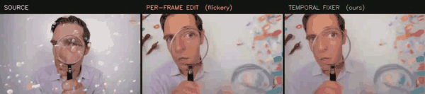

<h1 align="center">Temporal Fixer</h1>

<b>Image edits, video fixes.</b> 
A self-supervised, editor-agnostic temporal fixer that turns <i>any</i> per-frame image editor
into a temporally-consistent, streaming video editor — with <b>zero paired edit data</b> and a
<b>single</b> generation step.

---

## The idea

> **A causal video model should not be asked to edit; it should be asked to fix.**

State-of-the-art *image* editors (e.g. Qwen-Image-Edit) are excellent per frame but, run
frame-by-frame on a video, produce a **flickery draft** — each frame lands in a slightly different
look. Instead of training yet another dedicated, paired-data video editor, we keep the powerful image
editor **frozen** and add a lightweight **causal video fixer** that removes the flicker while
preserving the edit. The fixer is trained **only on clean video** (pseudo-style ⊗ per-frame
degradation), so it never needs a single paired `(source, edited)` video.

<b>SOURCE</b> · <b>PER-FRAME EDIT</b> (independent frames → flicker) · <b>TEMPORAL FIXER</b> (ours).
In motion, the middle panel jitters frame-to-frame while ours stays temporally stable.

## Headline results

Measured on **OpenVE-Bench** (spatially-aligned style edits) with the flow-warped flicker metric
(warp-error; lower = more temporally consistent; natural-video floor ≈ 1.05):

| | flow-warped flicker ↓ | edit preserved (CLIP) ↑ |
|---|:---:|:---:|
| Per-frame image editor (independent seeds) | 48.4 | — |
| **Ours (co-adapted editor + fixer)** | **6.13** | **0.959** |

> **End-to-end flicker cut by 87%** (48.4 → 6.13), single generation step, edit appearance retained,
> **no paired edit data**. The fixer also beats a naive optical-flow smoother on *both* flicker and
> edit-preservation.

The result **generalizes across a second independent benchmark and different edit types**:

| Benchmark | flicker reduction | VBench motion-smoothness | VBench subject-consistency |
|---|:---:|:---:|:---:|
| OpenVE-Bench (global style) | **−87%** | 0.838 → **0.979** | 0.670 → **0.918** |
| FiVE-Bench (color + material) | **−68%** | 0.863 → **0.966** | 0.704 → **0.841** |

## Head-to-head vs a dedicated streaming editor (LiveEdit)

Same 48 videos, official VBench protocol. LiveEdit is a strong, end-to-end, *edit-supervised*
streaming video editor; ours is editor-agnostic and uses **no paired edit data**.

| VBench dim | **Ours** | LiveEdit | note |
|---|:---:|:---:|---|
| dynamic_degree (motion) | **0.375** | 0.25 | **ours preserves more motion** |
| motion_smoothness | 0.979 | 0.993 | close |
| subject_consistency | 0.918 | 0.983 | LiveEdit leads |
| background_consistency | 0.929 | 0.966 | LiveEdit leads |
| imaging_quality | 0.565 | 0.714 | LiveEdit leads (bounded by the frozen editor's per-frame re-render) |
| aesthetic_quality | 0.535 | 0.580 | close |

**Honest takeaway.** Our system is *temporally near-SOTA* (motion-smoothness within noise of LiveEdit)
and **uniquely motion-preserving** — dedicated editors damp motion to look smooth (DD 0.25), whereas
ours keeps the source dynamics (DD 0.375). The remaining gap is **per-frame imaging quality**, which
is fundamentally capped by the frozen image editor's re-render. Closing that gap is the focus of our
ongoing work (a distribution-matching training objective, below).

## More comparisons

 Sketch style — per-frame line art flickers heavily; the fixer stabilizes it.

 Pop-art style.

 Watercolor style.

GIFs are shown at reduced resolution/frame-rate; full-resolution MP4s available on request.

## Method at a glance

1. **Editor (frozen).** A per-frame image editor with a stabilized sampling protocol (shared seed
   across frames) produces a draft. Fixing the sampler alone removes most of the "flicker" — much of
   it is a *sampling artifact*, not an editing artifact.
2. **Fixer (learned, causal, single-step).** A Wan-2.1 causal DiT, conditioned by channel-concat on
   `[draft | source]`, is trained self-supervised on clean video only. At inference it maps the draft
   to a temporally-consistent output in **one** Euler step — a streaming, editor-agnostic module.

The two stages are **co-adapted**: the fixer is trained to match the stabilized editor's statistics.
That co-adaptation is what breaks the ceiling that single-sided fixes could not.

## Ongoing work

We are testing whether the per-frame imaging-quality ceiling is an artifact of the **regression
(MSE) training objective** rather than the fixer mechanism or model scale. Replacing regression with
a self-supervised **distribution-matching (DMD)** objective — pulling the fixer's output onto the
real clean-video manifold while anchoring to the draft — is designed to synthesize sharp,
temporally-coherent detail without paired data. Results forthcoming.

## Status

Research preview. Numbers above are from held-out benchmark evaluations (OpenVE-Bench, FiVE-Bench,
VBench). Code release is in progress.

Comparison videos are model outputs on public benchmark clips, shown at reduced resolution/looped
for illustration.
